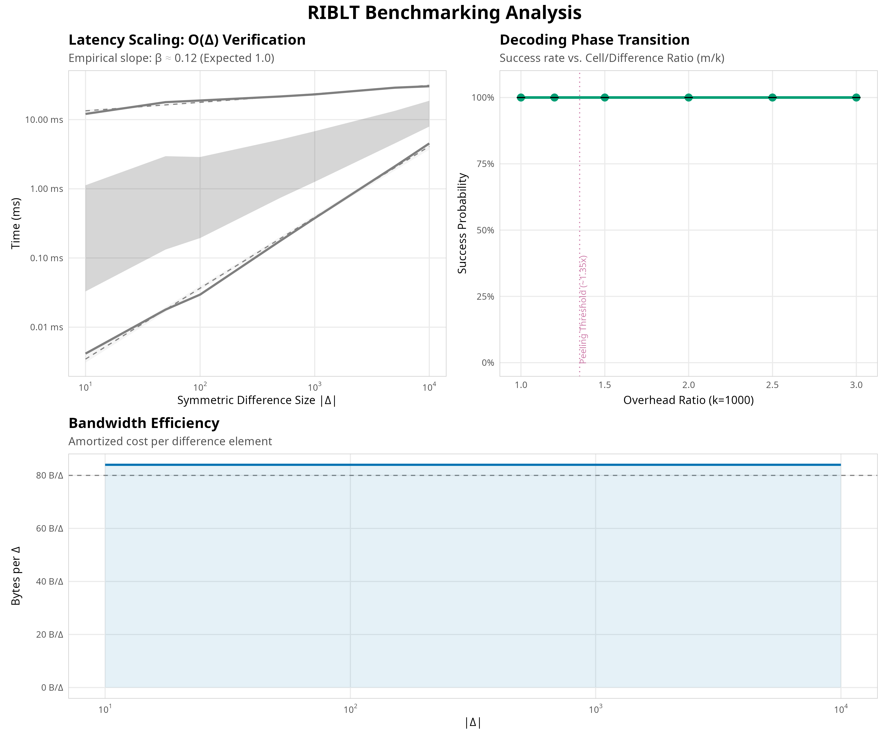

# RIBLT Performance Analysis (2026-03-13 12:51:49)

## Key Metrics

| Metric | Value |
| :--- | :--- |
| Avg Encode Time | 261.92 μs/element |
| Avg Decode Time | 0.39 μs/element |
| Avg Throughput | 74,684 elements/sec |
| Avg Bandwidth | 84.0 bytes/element |

## Visualizations

